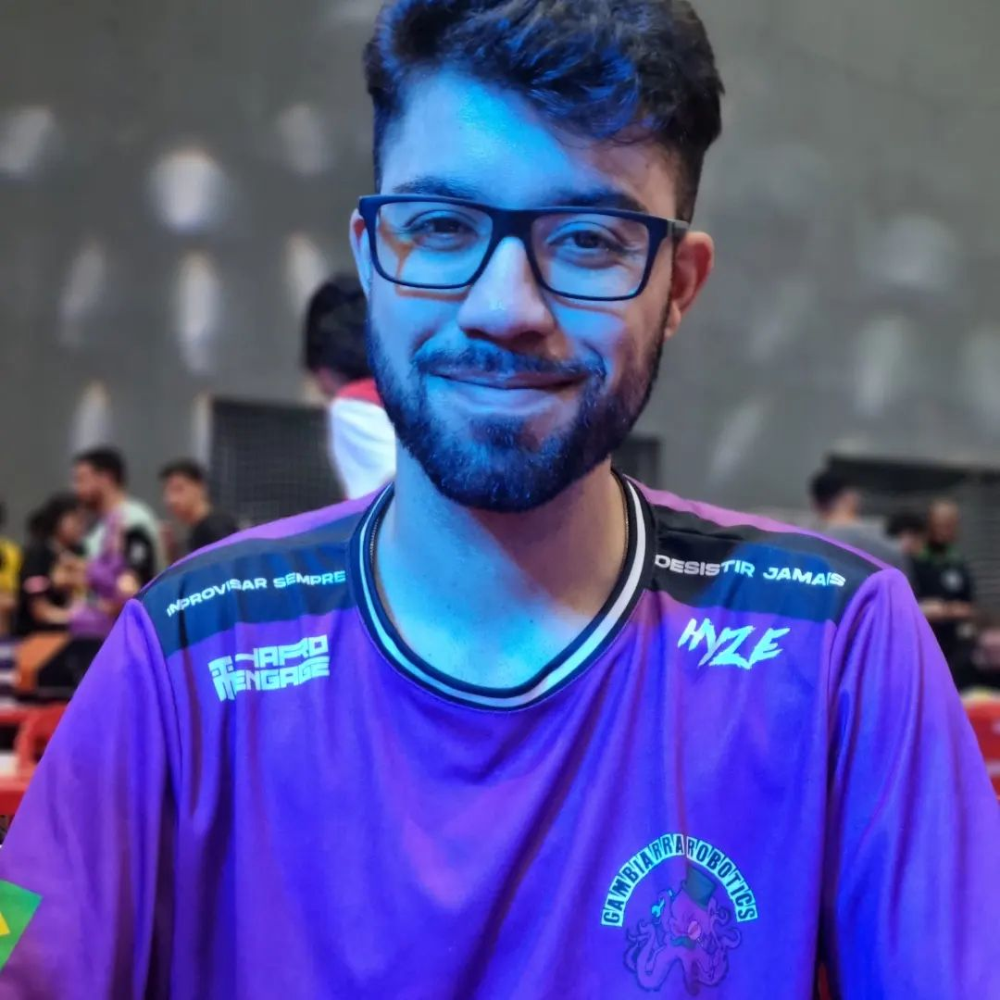

# BioEnergy


## Sobre o Projeto

BioEnergy é uma plataforma inovadora dedicada a promover o aproveitamento sustentável de resíduos orgânicos. Nossa missão é conectar pequenos produtores, que possuem excedentes de biomassa, com Organizações Não Governamentais (ONGs) e outras instituições que podem transformar esses recursos em energia limpa, biofertilizantes e outras soluções sustentáveis.

Acreditamos que, ao facilitar essa conexão, podemos contribuir significativamente para a redução do desperdício, a diminuição da emissão de gases de efeito estufa e a promoção de uma economia circular. Produtores rurais encontram uma forma de dar um destino nobre aos seus resíduos, enquanto ONGs ganham acesso a matéria-prima valiosa para seus projetos ambientais e sociais.

## Funcionalidades Principais

### Para Produtores
- Cadastro de produtores com informações detalhadas sobre os resíduos disponíveis
- Especificação de quantidade estimada e frequência de coleta
- Acompanhamento do status de aprovação

### Para ONGs e Instituições
- Cadastro de ONGs com detalhes sobre projetos e necessidades
- Especificação do tipo de biomassa necessária
- Acompanhamento do status de aprovação

### Para Administradores
- Painel administrativo para gerenciamento de produtores e ONGs
- Aprovação, rejeição, edição e exclusão de cadastros
- Visualização detalhada das informações de cada cadastro

## Tecnologias Utilizadas

- **Frontend**: Next.js, React, TypeScript, Tailwind CSS
- **Backend**: Flask (para geração de gráficos)
- **Implantação**: Cloudflare Workers
- **Banco de Dados**: SQL

## Instalação e Configuração

### Pré-requisitos
- Node.js (versão 20.18.0 ou superior)
- pnpm (versão 10.0.0 ou superior)
- Python 3.11 (para o backend Flask)

### Passos para Instalação

1. Clone o repositório:
```bash
git clone https://github.com/txgns/BioEnergy.git
cd BioEnergy
```

2. Instale as dependências:
```bash
pnpm install
```

3. Configure as variáveis de ambiente (se necessário):
```bash
cp .env.example .env.local
```

4. Execute o projeto em modo de desenvolvimento:
```bash
pnpm dev
```

5. Para o backend Flask (gráficos):
```bash
cd src/app/templates
pip install flask plotly
python app.py
```

## Estrutura do Projeto

```
BioEnergy/
├── components.json
├── env.d.ts
├── eslint.config.mjs
├── migrations/
│   └── 0001_initial.sql
├── next-env.d.ts
├── next.config.ts
├── open-next.config.ts
├── package.json
├── pnpm-lock.yaml
├── postcss.config.mjs
├── public/
│   ├── grafico_barras_bioenergy.html
│   ├── grafico_linha_bioenergy.html
│   └── img/
│       ├── Caio.jpeg
│       ├── Gabriella.jpg
│       ├── Lincon.jpg
│       ├── logo-parceiro-placeholder.png
│       ├── Niani.jpg
│       └── Rafa.png
├── src/
│   ├── app/
│   │   ├── admin/
│   │   │   ├── dashboard/
│   │   │   │   ├── ong-details.tsx
│   │   │   │   ├── page.tsx
│   │   │   │   └── produtor-details.tsx
│   │   │   └── page.tsx
│   │   ├── cadastro/
│   │   │   ├── ong/
│   │   │   │   └── page.tsx
│   │   │   └── produtor/
│   │   │       └── page.tsx
│   │   ├── doadores/
│   │   │   └── page.tsx
│   │   ├── graficos-bioenergia/
│   │   │   └── page.tsx
│   │   ├── impacto-e-exemplos/
│   │   │   └── page.tsx
│   │   ├── instituicoes/
│   │   │   └── page.tsx
│   │   ├── layout.tsx
│   │   ├── page.tsx
│   │   └── templates/
│   │       ├── app.py
│   │       └── index.html
│   ├── components/
│   │   ├── Footer.tsx
│   │   ├── Header.tsx
│   │   └── ui/
│   ├── hooks/
│   │   ├── use-mobile.tsx
│   │   └── use-toast.ts
│   └── lib/
│       └── utils.ts
└── tsconfig.json
└── wrangler.toml
```

## Equipe

<div align="center">

| Caio Souza | Gabriella Iglesias | Niani Palmonari | Lincon Amaro | Rafaella Andriotta |
|:----------:|:------------------:|:---------------:|:------------:|:------------------:|
|  |  |  |  |  |
| Desenvolvedor | Gerente de Projetos | Gerente de Projetos | Desenvolvedor | Desenvolvedor |

</div>


---

<div align="center">
  <p>Desenvolvido com 💚 pela equipe BioEnergy</p>
</div>

